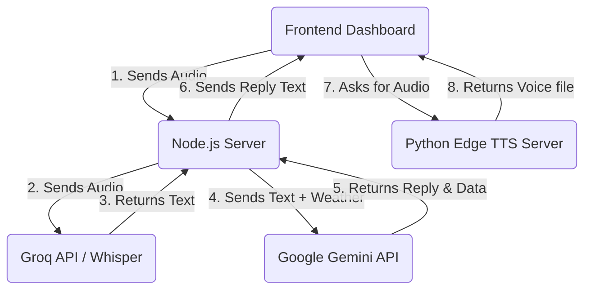
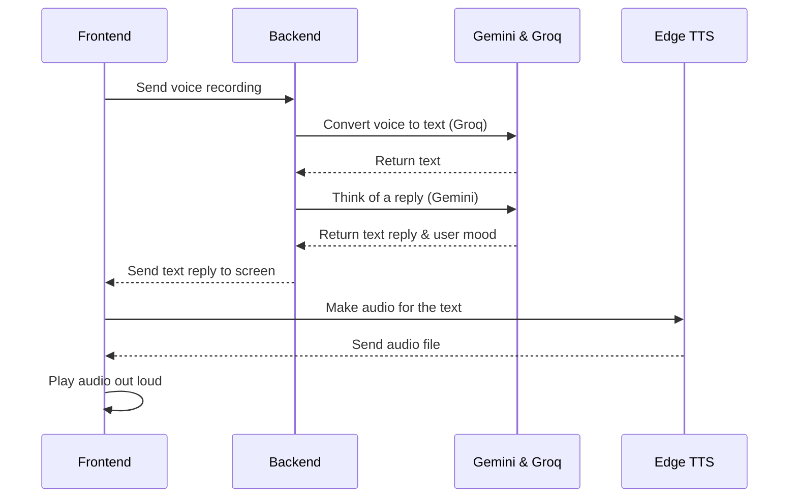

# Project Voice Module (Chatbot AI)

## 1. Speech-to-Text (STT) 
**How it works:**
- User holds the mic and speaks.
- The app records the voice.
- When the mic is released, the audio is sent to our backend.
- The backend sends the audio to the **Groq API** (using the Whisper model).
- Groq turns the audio into text instantly.

**Code Files to Show:**
- `server/services/groqService.js` (Where the Groq Whisper model is called)
- `server/controllers/chatController.js` (Where the backend handles the audio upload)

**Why we chose Groq (Whisper):**
- **It is extremely fast.** Users don't have to wait long.
- **High accuracy.** It understands what users say clearly.
- **Cost-effective.** It gives high performance at a low cost.

---

## 2. Chatbot Brain (LLM)
**How it works:**
- Once we have the text, we send it to **Google Gemini**.
- We also send: the past chat history, current weather, and local traffic.
- Gemini reads all this and does three things at once:
  1. Writes a short, friendly reply.
  2. Guesses the user's mood (happy, tired, etc.).
  3. Extracts important data (like today's earnings).

**Code Files to Show:**
- `server/services/conversationService.js` (Where the chatbot prompts and step-by-step conversation logic are)
- `server/services/geminiService.js` (Where the Gemini API is configured)

**Why we chose Gemini (Flash-Lite):**
- **It is fast.** The Flash-Lite model gives very quick answers.
- **Does multiple jobs at once.** It can chat and pull out data (like earnings) in a single step.
- **Great free tier.** Helps keep the project costs low.

---

## 3. Text-to-Speech (TTS)
**How it works:**
- We get the text reply from Gemini.
- The app sends it to a custom **Edge TTS** server (built with Python).
- Edge TTS converts the text into a real-sounding voice file.
- The app plays the voice file to the user.
- If the server fails, the app uses the browser's built-in voice instead.

**Code Files to Show:**
- `client/src/pages/user/DashBoard.jsx` (Where the frontend plays the incoming voice)
- `openai-edge-tts/app/server.py` (The Python server that creates the voice)

**Why we chose Edge TTS:**
- **Free and realistic.** It offers high-quality Indian-accent voices for free.
- **Better user experience.** Built-in browser voices often sound robotic, Edge sounds natural.

---

## 4. Architecture Diagram (How Parts Connect)

**What the diagram means:**
- The mobile/web app talks to our backend server.
- The backend uses Groq to understand the voice.
- The backend uses Gemini to think of a reply.
- Finally, the app uses an Edge TTS server to speak the reply out loud.

---

## 5. Sequence Diagram (Step-by-Step Flow)

**What the sequence means:**
- **First:** The app sends the user's voice to the server.
- **Second:** The server uses AI APIs to get the text, figure out the reply, and extract data.
- **Third:** The server gives the written reply back to the app.
- **Fourth:** The app turns that written reply into voice using the TTS server and plays it.

---

## 6. Real-World Example Conversation

Here is an example of what a typical voice check-in looks like between the worker and the Chatbot.

1. **Chatbot (Voice):** "Ready when you are! Tap the mic button to start your daily check-in. Aaj din kaisa raha?"
2. **Worker (Voice):** "Aaj thoda thak gaya, bahut traffic tha yaar. Uber par kaam kiya maine aaj."
3. **Backend Processing (Invisible):**
   - The AI detects the Worker's **Mood:** `Tired`
   - The AI saves the **Platform:** `Uber`
4. **Chatbot (Voice):** "Traffic mein chalana mushkil hota hai, thakan toh hoti hai. Aapne Uber pe aaj kitna kamaya?"
5. **Worker (Voice):** "Aaj maine 1200 rupees kamaye."
6. **Backend Processing (Invisible):**
   - The AI saves the **Earnings:** `1200`
7. **Chatbot (Voice):** "Awesome job! 1200 rupees is a solid day! Aaram kar lijiye ab kal milte hain."

The entire conversation is completely hands-free and recorded directly into the project's database without the worker ever having to type a single word.
