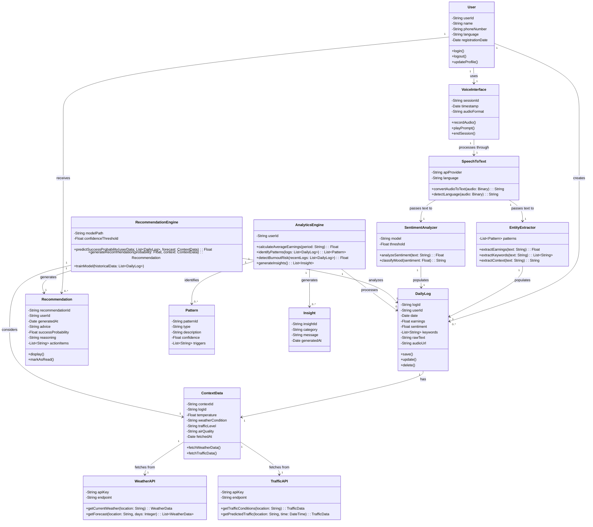
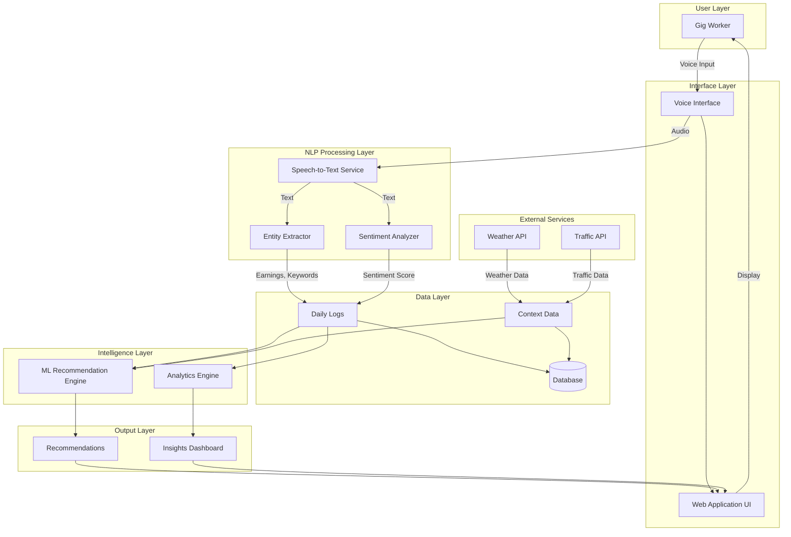
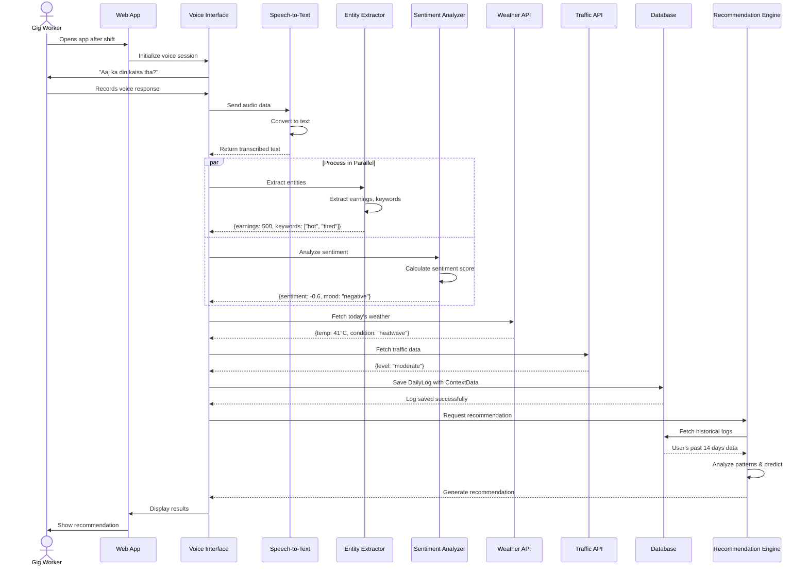
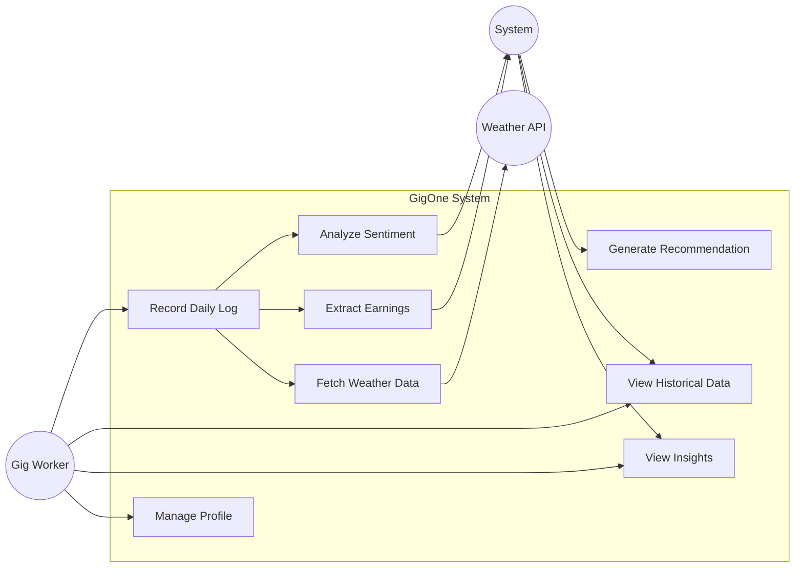
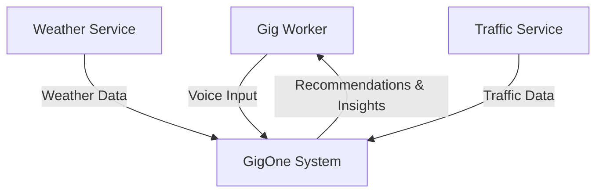
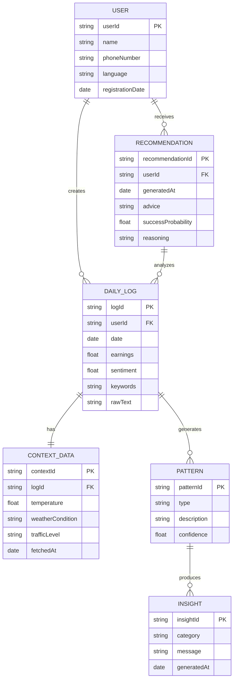

# GigOne - UML Class Diagram

## System Architecture Overview

The GigOne system is a voice-first personal assistant for gig economy workers that analyzes daily earnings, sentiment, and environmental factors to provide personalized recommendations.

## System Component Diagram

## Sequence Diagram: Daily Log Creation Flow

## Use Case Diagram

## Data Flow Diagram (Level 0 - Context Diagram)

## Entity Relationship Diagram

## Key Design Principles

### 1. **Voice-First Architecture**

- All user input flows through the `VoiceInterface` class
- Supports Hinglish (Hindi + English) mixed language input
- Optimized for low-literacy users

### 2. **Separation of Concerns**

- **NLP Layer**: Handles all text processing (STT, entity extraction, sentiment)
- **Data Layer**: Manages persistent storage
- **Intelligence Layer**: ML models and analytics
- **Integration Layer**: External API communications

### 3. **Context Awareness**

- Every `DailyLog` is linked to `ContextData`
- Correlates subjective (sentiment) with objective (weather) data

### 4. **Recommendation Engine**

- Analyzes historical patterns
- Considers forecasted conditions
- Provides actionable advice with reasoning

### 5. **Scalability Considerations**

- Single-user system initially
- Database design supports multi-user expansion
- API integrations abstracted for easy provider switches

## Technology Stack (Implied from Design)

| Component              | Technology                         |
| ---------------------- | ---------------------------------- |
| **Speech-to-Text**     | OpenAI Whisper / Google Speech API |
| **Sentiment Analysis** | VADER / TextBlob                   |
| **Entity Extraction**  | Regex / spaCy                      |
| **ML Framework**       | Scikit-learn / TensorFlow          |
| **Database**           | PostgreSQL / MongoDB               |
| **Backend**            | Python (Flask/FastAPI)             |
| **Frontend**           | React / Vue.js (PWA)               |
| **Weather API**        | OpenWeatherMap                     |
| **Traffic API**        | Google Maps / TomTom               |

---

**Created for:** GigOne Project  
**Date:** 2026-02-11  
**Purpose:** System design documentation and implementation reference
